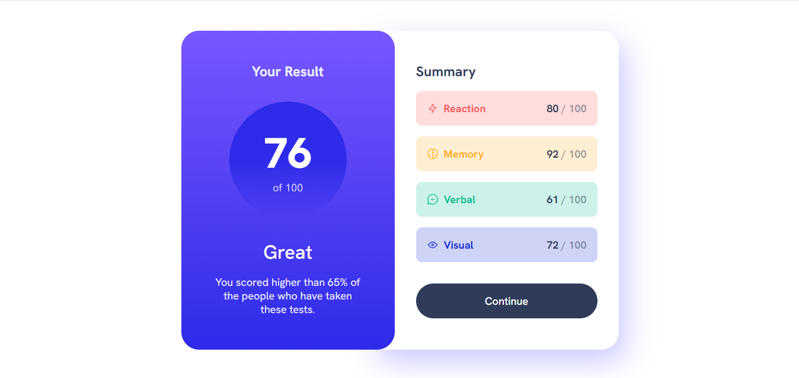

# Frontend Mentor - Results summary component solution

This is a solution to the [Results summary component challenge on Frontend Mentor](https://www.frontendmentor.io/challenges/results-summary-component-CE_K6s0maV). Frontend Mentor challenges help you improve your coding skills by building realistic projects. 

## Table of contents

- [Descripción General](#Descripción-General)
  - [El Desafío](#El-Desafío)
  - [Screenshot](#screenshot)
  - [Links](#links)
- [Mi Proceso](#Mi-Proceso)
  - [Construido-Con](#Construido-Con)
  - [¿Que aprendí?](#Que-aprendí)
- [Author](#author)
- [Agradecimientos](#Agradecimientos)

## Descripción General

### El Desafío

Los usuarios deberían poder:

- Ver el diseño óptimo de la interfaz según el tamaño de la pantalla de su dispositivo
- Ver los estados de desplazamiento y enfoque de todos los elementos interactivos de la página
- **Bonus**: utilizar los datos JSON locales para completar el contenido de forma dinámica

### Screenshot

### Links

- Solution URL: [Add solution URL here](https://www.frontendmentor.io/solutions/results-summary-component-5sfWd7YrFW)
- Sitio en vivo: [Add live site URL here](https://results-summary-component-main-psi-bice.vercel.app/)

## Mi Proceso

### Construido Con

- Marcado HTML5 semantico
- Metodología BEM
- CSS custom properties
- Flexbox

### ¿Que aprendí?

Se conocío de manera más profunda el manejo de flexbox, tuve alguno que otro problema con respecto a las medidas necesaría que tenían que colocarse en las fuentes, también practique mucho la escritura de clases CSS con la metodología BEM

## Author

- Frontend Mentor - [@Adriverion](https://www.frontendmentor.io/profile/Adriverion)
- X - [@_Adriverion_](https://x.com/_Adriverion_)

## Agradecimientos

Agradezco mucho a mis amigos que me motivaron a estudiar frontend
